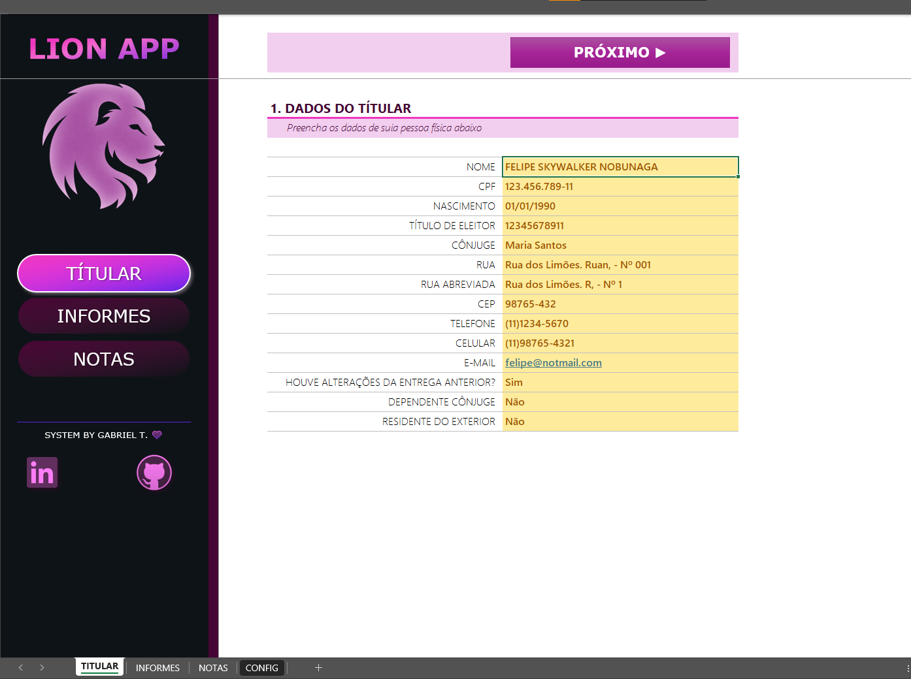
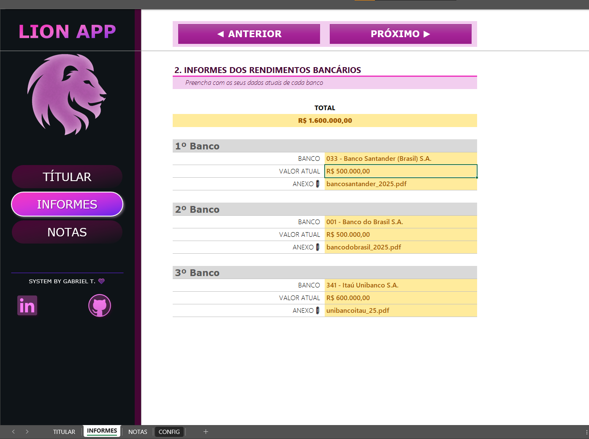
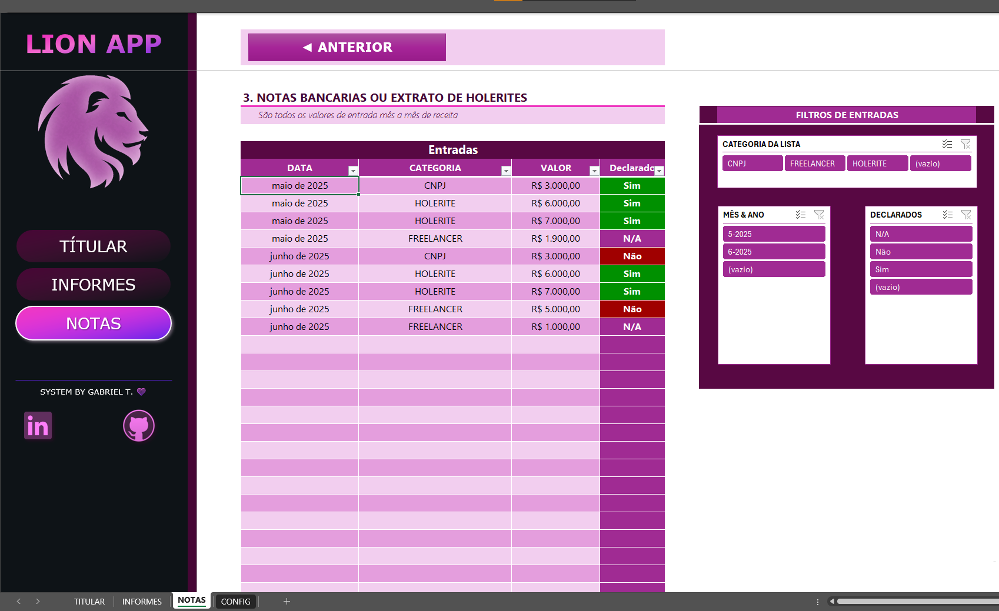
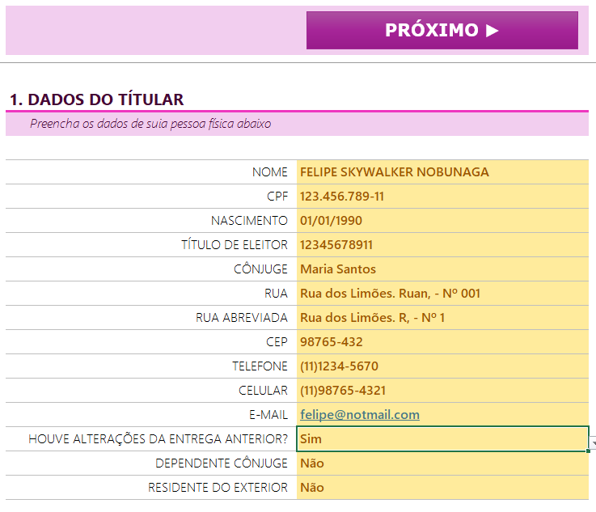
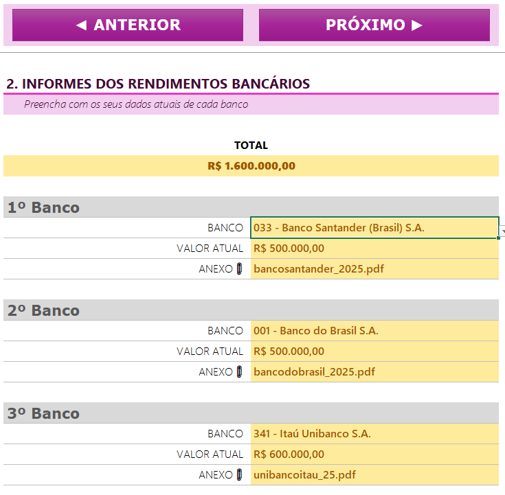
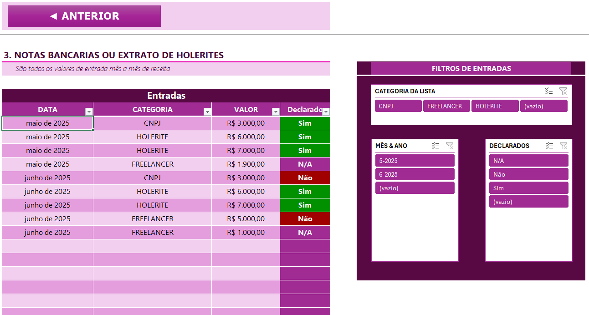

# Desafio-DIO-Excel-2

***DESAFIO DE CURSO DIO - Projeto de Excel ✒***         
****FERRAMENTA DE IMPOSTO DE RENDA****

## 📄 Descrição

O objetivo dessa ferramenta é focada em auxiliar o usuário a reunir informações essenciais para declaração de Imposto de Renda, na qual possa facilitar o controle de suas entradas de maneira eficiente e clara.

Este projeto foi desenvolvido com o intuito de aplicar conceitos de Excel em um organizador de dados para Declarações de Imposto de Rendas, utilizando validação de dados, formatações de celulas e segmentação de dados.

Nesta planilha temos três *Dashboard* separados em diferentes páginas.  
Este modelo pode ser usado como base para futuras expansões e personalizações. 

## ⚙ Estrutura
Essa ferramenta contém os seguintes painéis:
- TÍTULAR
- INFORMES
- NOTAS

Pode ser feita a transição desses painéis clicando nos botôes no cabeçalho dos Dashboards (Anterior / Próximo), seguindo a ordem descrita acima.   
Não apenas isso, mas  o usuário pode utilizar os botões do lado esquerdo, para pular diretamente aos painéis. 

Nos painéis de TÍTULAR e INFOMES, os campos que estão com FUNDO AMARELO são os que o usuário pode editar para colocar sua entrada. Enquanto no painel de NOTAS os campos editáveis são os que estão dentro da tabela. 

    

## 🧱 Passo a Passo

### Etapa 1: TÍTULAR

Nesta página, você pode preparar os dados para declaração na primeira página. Nela, você pode inserir o: 
  01. NOME: Preencher o nome completo do títular; 
  02. CPF: Preencher o CPF completo, com o total de 11 números; 
  03. NASCIMENTO: Data de nascimento; 
  04. TÍTULO DE ELEITOR: Preencher o nº de inscrição, com o total de 12 números; 
  05. CÔNJUGE: Preencher o nome completo do Cônjuge do títular. Caso não tenha, colocar N/A; 
  06. RUA: Preencher o nome da rua na qual atualmente mora; 
  07. RUA ABREVIADA: Preencher o nome abrevido da rua na qual atualmente mora; 
  08. CEP: CEP da rua, sendo o mesmo nos comprovantes de residência/Site dos correios; 
  09. TELEFONE: Telefone residêncial, caso tenha; 
  10. CELULAR: Telefone celular do títular; 
  11. E-MAIL: Preencher o E-mail do títular;      

Também tem três campos para sempre ajustar e declarar, caso ocorra novas atualizações: 

  12. HOUVE ALTERAÇÕES DA ENTREGA ANTERIOR? : Sim/Não; 
  13. DEPÊNDENTE CÔNJUGE? : Sim/Não; 
  14. RESIDÊNTE DO EXTERIOR? : Sim/Não; 

### Etapa 2: INFORMES

Neste painel, o usuário, como pessoa física, pode inserir seus dados atuais de cada banco relevante para a Declaração de Imposto de Renda, juntamente com o valor atual no banco.   
  1. BANCO: Código - Nome do banco do títular;
  2. VALOR ATUAL: Valor em R$ em depósito neste banco;
  3. ANEXO: Via do banco. 

Você pode adicionar de 1 a 3 bancos vinculado ao seu CPF.

***TOTAL***
Valor total calculados com o bancos inseridos neste painel 

### Etapa 3: NOTAS

Por fim, este painel serve para o usuário inserir todos os valores de entrada de receita, sendo atualizada mês a mês.   
Isso inclui Notas bancárias ou Extratos de Holerites. 
   
Cada uma das linhas é uma entrada exclusiva que recebeu no mês, e é dividído em quatro colunas.
   
****TABELA - ENTRADAS****
  1. Coluna DATA: Inserir a data completa da entrada, para facilitar a visualização, a coluna está formatada para MÊS e ANO (mmmm "de" aaaa); 
  2. Coluna CATEGORIA: Escolhe uma das três opções da lista (CNPJ, HOLERITE OU FREELANCER); 
  3. Coluna VALOR: Valor em R$ da entrada;
  4. Coluna DECLARADOS: Confirmação se essa entrada se aplica para a declaração de Imposto de Renda. 
  
Não só nessa tabela contém filtros para auxiliar na análise dos dados, mas também temos uma **Segmentação de Dados** para deixar mais prático o controle das informações. Isso inclui as *CATEGORIAS*, *MÊS & ANO* e *DECLARADOS*. 

## 🛠 Considerações Finais
Também tem uma planilha chamada ****"CONFIG"**** que contém os ***NOMES DOS BANCOS*** e os tipos predefinidos de ***CATEGORIA*** para a validação de dados, importante para que os painéis funcionem corretamente.

Gostaria de agradecer ao professor da DIO, Felipe Aguiar, pelas aulas fantásticas e explicações sobre o tema.
Futuramente posso fazer um ajuste ou outro no arquivo e em suas funcionalidades, caso necessário.
